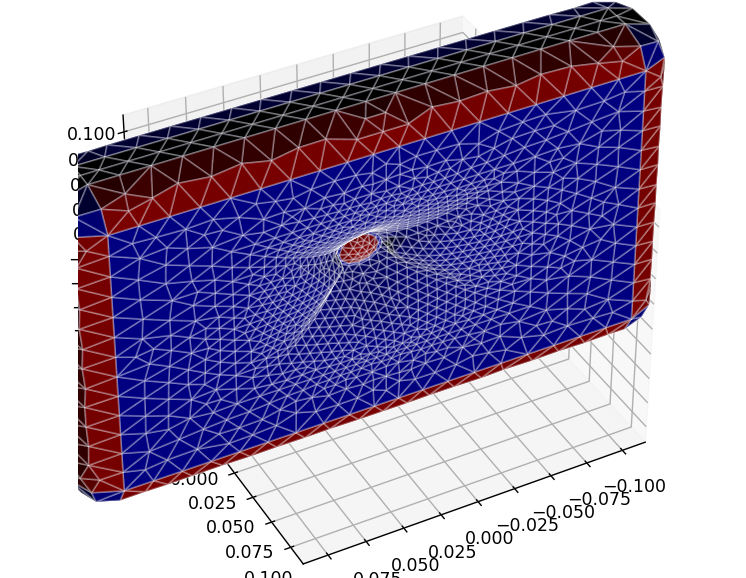
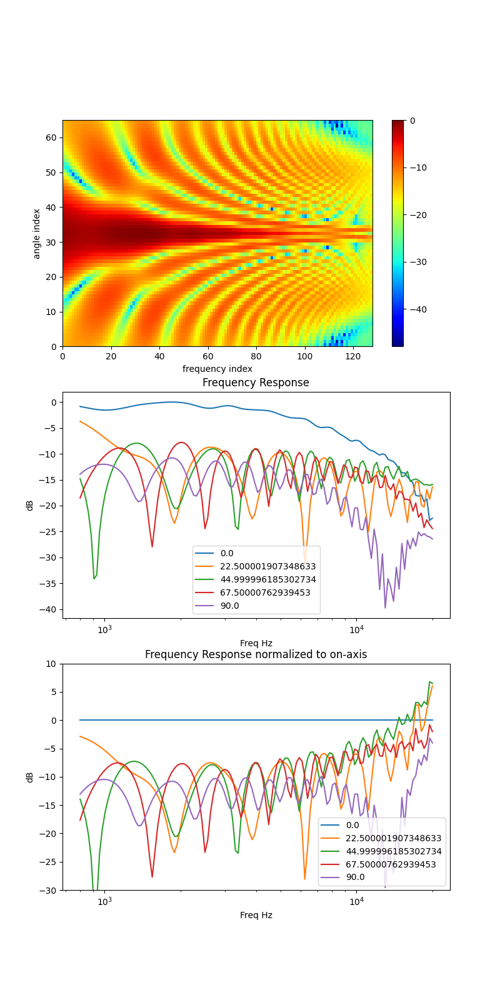

# wavextrema

Note: This is not an officially supported Google product

## Introduction

This project is an implementation of acoustic simulation.  currently,
it supports the boundary element method in 2D and 3D for solving
the Helmholtz equation.

* Solves 2D and 3D BEM systems with Dirichlet, Neumann, or mixed
 boundary conditions.
* Future plans
  * Optimizing splines to optimize structures for acoustic properties.
  * Lumped models for modeling e.g. electromechanical systems like
   Thiele-Small speakers and crossovers.
  * FEM methods for elastic deformation coupling with acoustics simulation.

This was primarily written to handle horns for hobby loudspeakers.
The math used in this software is discussed in detail in 

* Kirkup, Stephen Martin. The boundary element method in acoustics. Integrated sound software, 2007.

Beside the Berton-Miller method used in Kirkup, we also implement the more modern, faster,
and simpler Dual Surface method as in

* Mohsen, A., and M. Hesham. "An efficient method for solving the nonuniqueness problem in acoustic scattering." Communications in numerical methods in engineering 22.11 (2006): 1067-1076.

## Getting started

Run some examples. All examples are listed if you run
bem_examples.py with no arguments.

```shell
pip3 install --upgrade quadpy scipy gmshparser matplotlib
python3 wavextrema/bem_examples.py example   # Get list of options
python3 wavextrema/bem_examples.py example1  # Run basic 1d
python3 wavextrema/bem_examples.py example2  # Run basic 2d
```

## Using a mesh

If you make a mesh using gmsh and make a physical group
"emit", you can see how normal emission will effect directional
frequency response.

```shell
python3 wavextrema/run_directivity.py meshes/example_waveguide.msh
```
produces






Apache header:

    Copyright 2021 Google LLC

    Licensed under the Apache License, Version 2.0 (the "License");
    you may not use this file except in compliance with the License.
    You may obtain a copy of the License at

        https://www.apache.org/licenses/LICENSE-2.0

    Unless required by applicable law or agreed to in writing, software
    distributed under the License is distributed on an "AS IS" BASIS,
    WITHOUT WARRANTIES OR CONDITIONS OF ANY KIND, either express or implied.
    See the License for the specific language governing permissions and
    limitations under the License.
